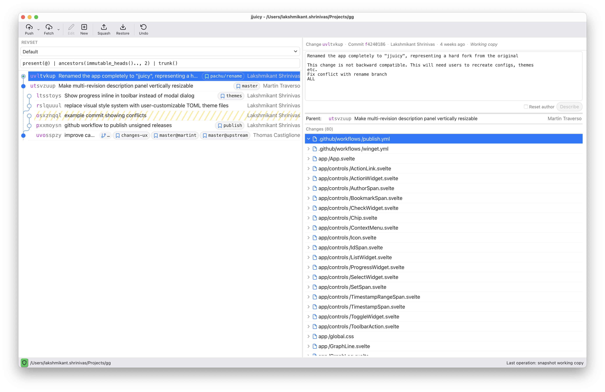

#  jjuicy - a GUI for JJ



jjuicy is a GUI for the version control system [Jujutsu](https://github.com/jj-vcs/jj). It takes advantage of Jujutsu's composable primitives to present an interactive view of your repository. The big idea: what if you were always in the middle of an interactive rebase, but this was actually a good thing?

## Installation
jjuicy is a desktop or web application with a keyboard & mouse interface. It may be available in your favourite package manager, including...
```
# MacOS
brew install --cask jjuicy
# Windows
winget install --id starburst.jjuicy
# Any platform supported by [Tauri](https://tauri.app/)
cargo install --locked jjuicy-cli
```

Binaries are published for several platforms on the [releases page](https://github.com/gulbanana/gg/releases). Use the `.dmg` or `.app.tar.gz` on MacOS, and the `.msi` or `.exe` on Windows. We have `.appimage`, `.deb` and `.rpm` for some Linux platforms, but they aren't as well-tested.

### Setup
Run `ju` in a Jujutsu workspace, pass the workspace directory as an argument or launch it from a GUI and use the Repository->Open menu item. Tips:
- `ju` or `ju gui` will launch a native application, `ju web` will open a web browser.
- If you downloaded a release yourself, `ju` won't be on your PATH - try adding `/Applications/jjuicy.app/Contents/MacOS/` or `C:\Program Files\jjuicy\`.
- When using a POSIX shell on Windows, `start ju` can be used to run in the background.

### Configuration
jjuicy uses `jj config`; `revset-aliases.immutable_heads()` is particularly important, as it determines how much history you can edit. jjuicy has some additional settings of its own, with defaults and documentation [here](src/config/jjuicy.toml).

## Features
jjuicy doesn't require [JJ](https://jj-vcs.github.io/jj/latest/install-and-setup/) installed, but you'll want it for tasks jjuicy doesn't cover. What it *does* cover:
- Use the left pane to query and browse the log. Click to select revisions, shift-click for multiple selection, double-click to edit (if mutable) or create a new child (if immutable).
- Use the right pane to inspect and edit revisions - set descriptions, issue commands, view their parents and changes.
- Drag revisions around to rebase them; move them into or out of a revision's parents to add merges and move entire subtrees. Or just abandon them entirely.
- Drag files around to squash them into new revisions or throw away changes (restoring from parents).
- Drag bookmarks around to set or delete them.
- Right click on any of the above for more contextual actions.
- Push and fetch git changes using the bottom bar.
- View diffs or resolve conflicts in an external tool (if you have one configured).
- Undo anything with ⟲ in the bottom right corner.

More detail is available in [the changelog](CHANGELOG.md).

### Future Features
There's no roadmap as such, but items on [the to-do list](doc/TODO.md) may or may not be implemented in future.

### Known Issues
jjuicy is lightly maintained and may have bugs. In theory it can't corrupt a repository thanks to the operation log, but it never hurts to make backups.

If your repo is "too large" some features will be disabled for performance. See [the default config](src/config/jjuicy.toml) for details.
